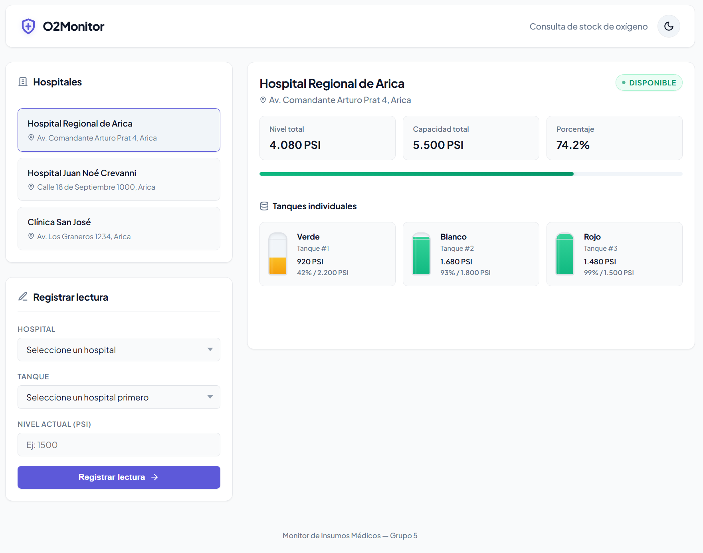

# Frontend — Interfaz Web

> Nivel 2 — Presentación. HTML/CSS/JS estático servido con nginx:alpine.

## Stack

- **Servidor web**: `nginx:alpine` (Alpine Linux)
- **Frontend**: HTML5, CSS3, Vanilla JavaScript (sin frameworks)

## Dockerfile

```dockerfile
FROM nginx:alpine
COPY index.html /usr/share/nginx/html/
COPY css/ /usr/share/nginx/html/css/
COPY js/ /usr/share/nginx/html/js/
RUN chown -R nginx:nginx /usr/share/nginx/html
EXPOSE 80
```

## Funcionalidad

- Listado de hospitales en tarjetas interactivas
- Consulta de stock con barra de progreso y badge Disponible/Agotado
- Detalle de tanques con niveles individuales
- Formulario para registrar nuevas lecturas de PSI
- Todas las llamadas a la API son same-origin (`/api/*`) vía el proxy — sin CORS

## Vista de la Interfaz

A continuación se presenta una captura del panel de control

<p align="center">
  
</p>

## Estructura

```
frontend/
├── Dockerfile
├── index.html          # Estructura HTML
├── css/
│   └── style.css       # Estilos responsivos
└── js/
    └── app.js          # Lógica: fetch API, manipulación DOM
```

## Comunicación

El frontend no se comunica directamente con el backend. Todas las peticiones a `/api/*` pasan por el proxy nginx, que las enruta al backend. Esto mantiene el aislamiento de red y evita configuraciones CORS.
